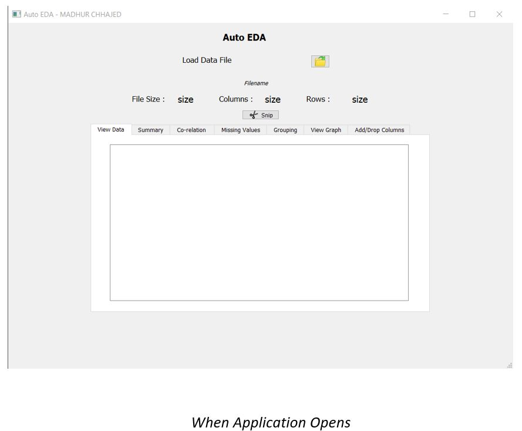
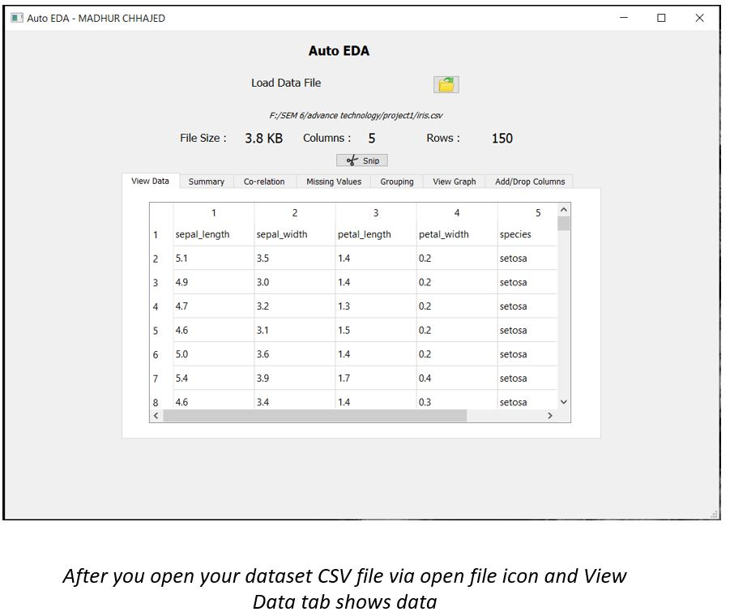
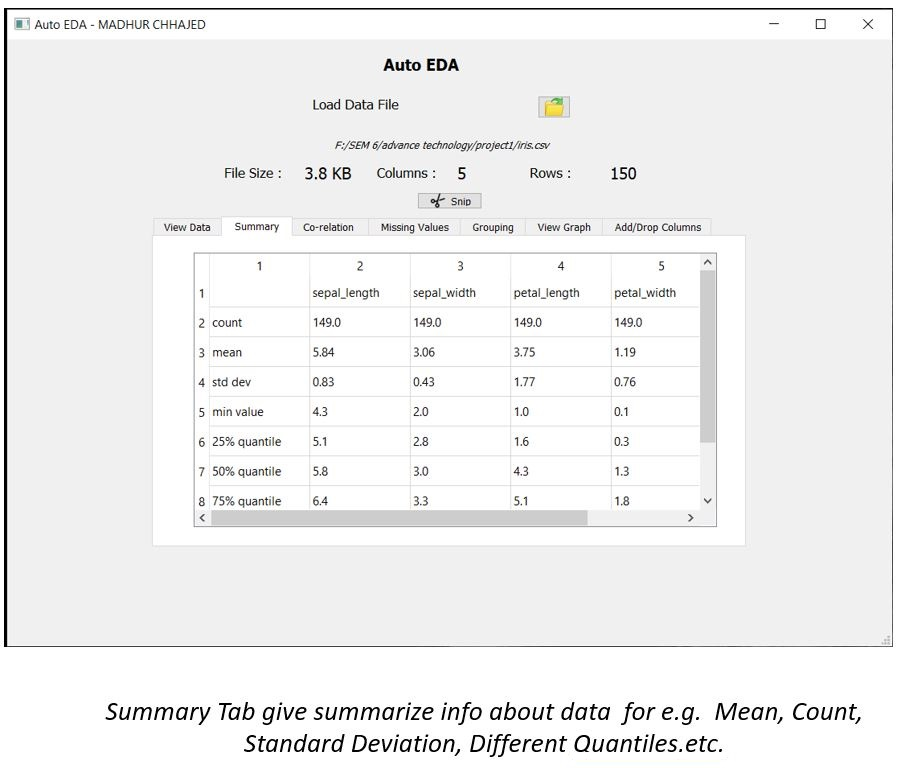
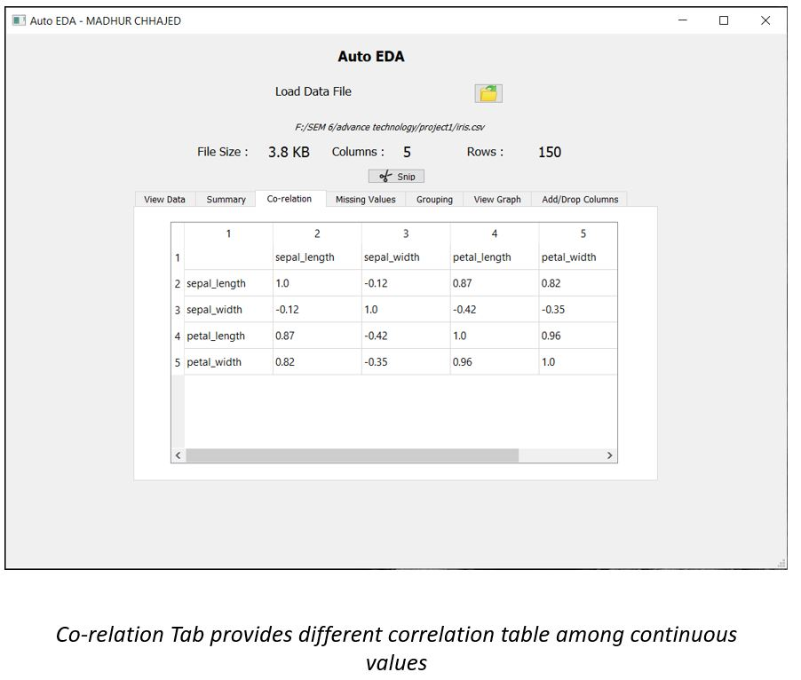
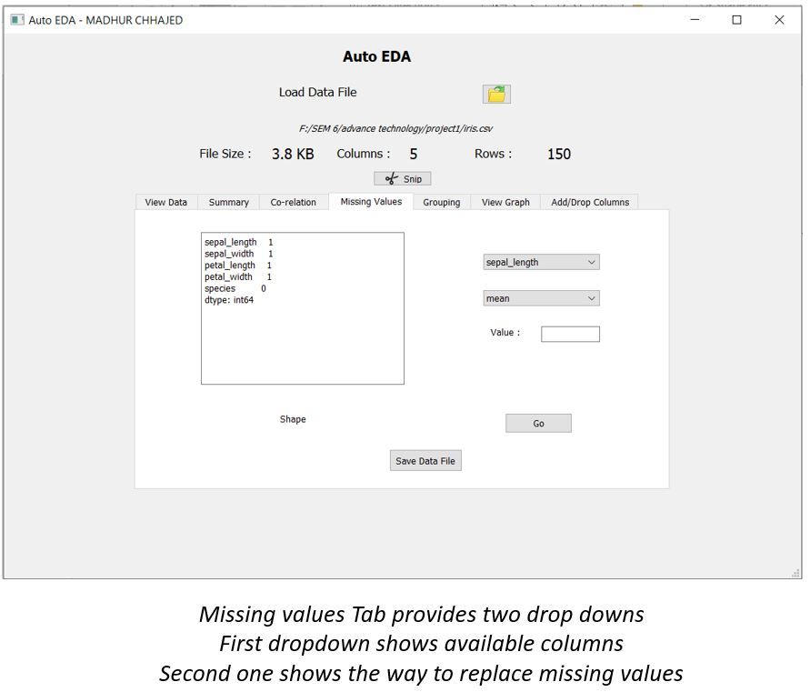
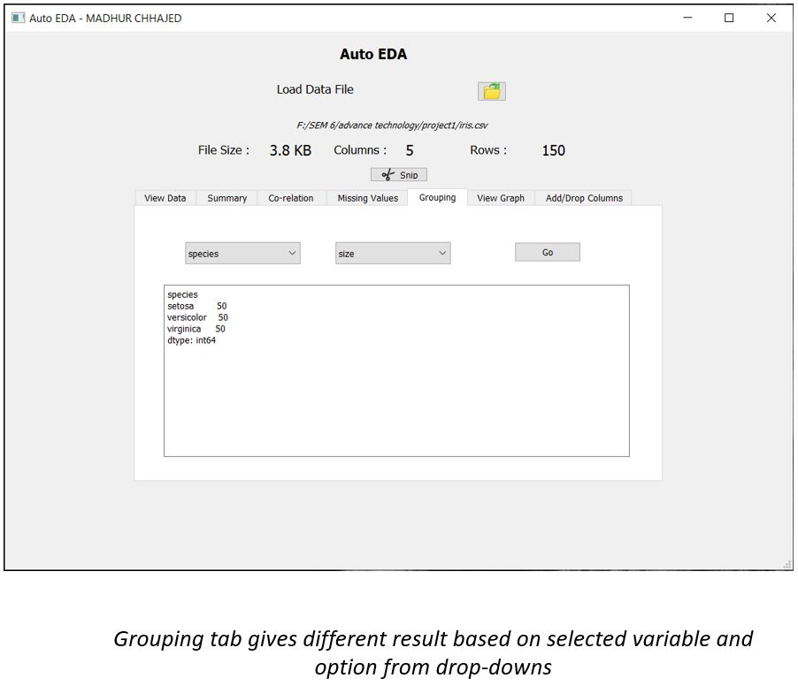
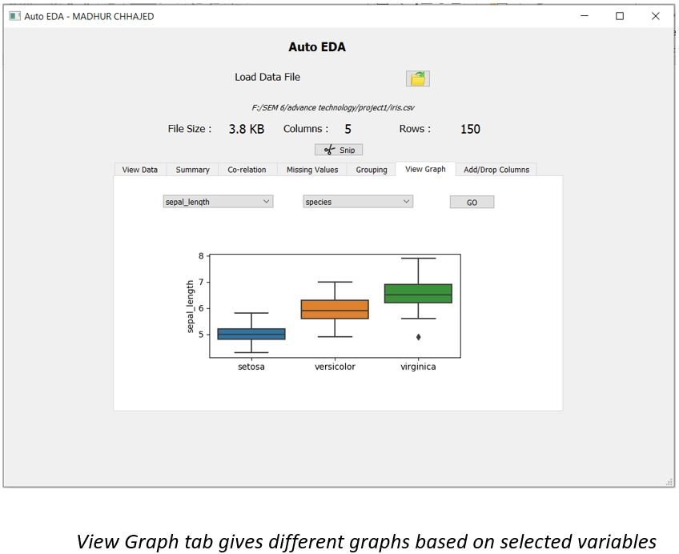
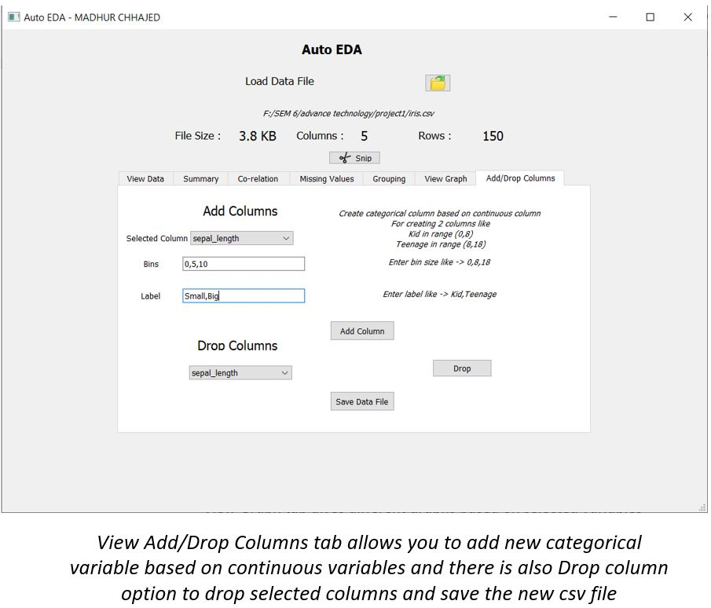

# Auto-Exploratory-Data-Analysis
A desktop application was created which will allow user to perform basic data analysis and pre-processing of CSV dataset easily.

 All the process like getting general information of data, statistical functions, handling missing values, creating graph etc will be done through GUI just by clicking process so that user will not have to write any piece of code and all the basic steps in analysing and pre-processing of data could be done easily.
 
 Version: 
 • Python 3.7.0
 • PyQt5 Version: 5.14.2
 • Matplotlib Version: 3.2.1
 • Seaborn Version: 0.10.0
 • Numpy Version: 1.18.2

 
   • Hardware  (Tested)
           • Processor – Intel Core i7-7700HQ CPU  
           • Installed RAM – 8.00 GB  
           • System type – 64-bit OS
           

  
 

